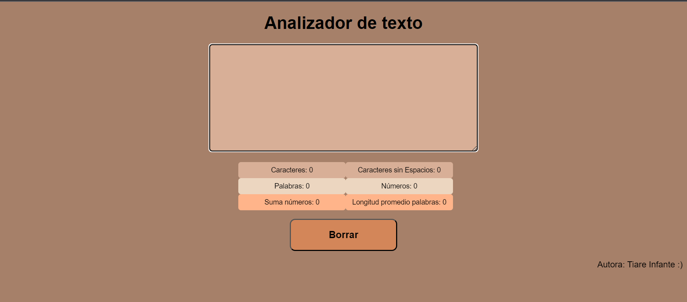

# Analizador de Texto

## Índice

- [1. Analizador de Texto](#1-analizador-de-Texto)
- [2. Visualización](#2-Visualización)
- [3. Funcionalidades](#3-funcionalidades)
- [4. Uso](#4-Uso)

## 1. Analizador de Texto

- Este proyecto es un analizador de texto que te permite obtener informacion sobre el contenido de un texto, como el número de palabras, caracteres, números y la longitud promedio de las palabras.
  Es una herramienta útil para analizar de manera rápida el contenido de tu texto.

## 2. Visualización

## 3. Funcionalidades

Este analizador de texto te proporciona las siguientes funcionalidades:

1. Contar Palabras: Calcula el número de palabras ingresadas.
2. Contar Caracteres: Determina la cantidad total de caracteres, incluyendo espacios, letras, números y signos de puntuación.
3. Contar Caracteres sin Espacios: Muestra la cantidad de caracteres pero excluye los espacios y signos de puntuación.
4. Longitud Promedio de Palabras: Calcula la longitud promedio de las palabras.
5. Contar Números: Identifica y cuenta todos los números en el texto.
6. Suma de Números: Calcula la suma de todos los números encontrados.

- Estas dos últimas funciones no toma encuenta aquellos números que se encuentren dentro de una palabra.\*

## 4. Uso

1. Ingresa el texto que deseas analizar en el area/cuadro de texto proporcionado.
2. A medida que ingreses y modifiques tu escrito, los resultados se actualizaran automáticamente en la lista de funcionalidades.
3. Si deseas borrar tu escrito y restablecer los resultados, haz clic en el botón "Borrar" ubicado en la parte inferior.
